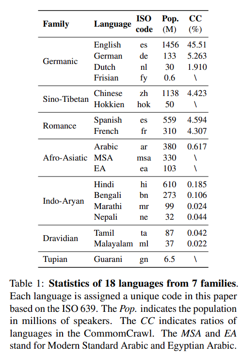

# CodeMixBench: Evaluating Code-Mixing Capabilities of LLMs Across 18 Languages

<p align="center">
   📑&nbsp; <a href="https://arxiv.org/abs/2507.18791](https://arxiv.org/abs/2507.18791" target="_blank">Paper</a>
   | 📊&nbsp; <a href="https://huggingface.co/datasets/CodeMixBench/CodeMixBench" target="_blank">HuggingFace</a>
</p>

## ℹ️ Overview
Code-mixing is a linguistic phenomenon where multilingual speakers switch or mix two or more languages within a single utterance or conversation. 
To evaluate LLMs’ comprehension of multilingual code-mixed texts, we introduce CodeMixBench, a benchmark comprising eight tasks across 18 languages. 

Our benchmark comprises synthesized datasets targeting knowledge reasoning, 
mathematical reasoning, and truthfulness tasks, along with LID, POS, NER, SA, and MT tasks, 
which have been adapted from open-source studies. 
For knowledge reasoning, we developed the code-mixed MMLU (CM-MMLU) based on the MMLU test set, 
featuring multiple-choice questions from 57 subjects to assess the model's comprehensive knowledge reasoning abilities. 
For mathematical reasoning, we created the code-mixed GSM8K (CM-GSM8K), derived from the GSM8K test set, 
which evaluates mathematical reasoning capabilities with each question including step-by-step solutions. 
For truthfulness assessment, we constructed the code-mixed TruthfulQA (CM-TruthfulQA) using 817 multiple-choice 
questions from the TruthfulQA test set. 

The datasets encompass 12 languages from six families: Germanic
(en, de, nl), Romance (es, fr), Sino-Tibetan (zh),
Afro-Asiatic (ar), Indo-Aryan (hi, bn, mr, ne), and
Dravidian (ta).
We synthesized 11 code-mixed language pairs for CM-
MMLU(based on the MMLU) with 12,156 question-option-answer com-
binations, 4 pairs for CM-TruthfulQA with 3,122
multiple-choice instances, 4 pairs for CM-GSM8K
with 4,367 math problems, and 3 pairs for MT with
2,711 code-mixed sentences.



## ⚙️ Setup
1. Follow these steps to set up your development environment:
   ```
   git clone git@github.com:Jeromeyluck/CodeMixBench.git
   cd CodeMixBench

   conda create -n CodeMixBench python=3.9
   conda activate CodeMixBench
   pip install -r requirements.txt
   ```
   
## 🚀 Launch LocAgent

   ```
   python ./test_model.py \
     --dataset lid_guaspa \
     --expid lid_guaspa_all_0shot \
     --model gpt-3.5-turbo \
     --shot 5 \
     --api sk-*********************
     --url https://****************
   ```
   - `dataset`: select the dataset (e.g., `lid_gereng`, `lid_spaeng`, `ner_hineng`).
   - `expid`: define the ID of the test, the results file will be named after this ID.
   - `model`: the model you test. The default model is gpt-3.5-turbo.
   - `shot`: use for few-shot test (by default it will be `1`).
   - `api`: API Key (default key will be `OPENAI_API_KEY` defined in system path).
   - `url`: 


##📑 Cite US

<!-- If there is a paper or blog post introducing the dataset, the APA and Bibtex information for that should go in this section. -->

**BibTeX:**

  ```
  ```
